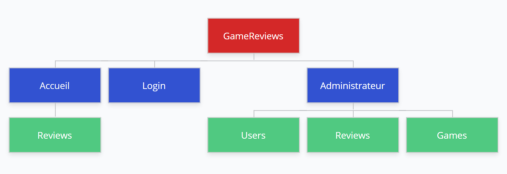
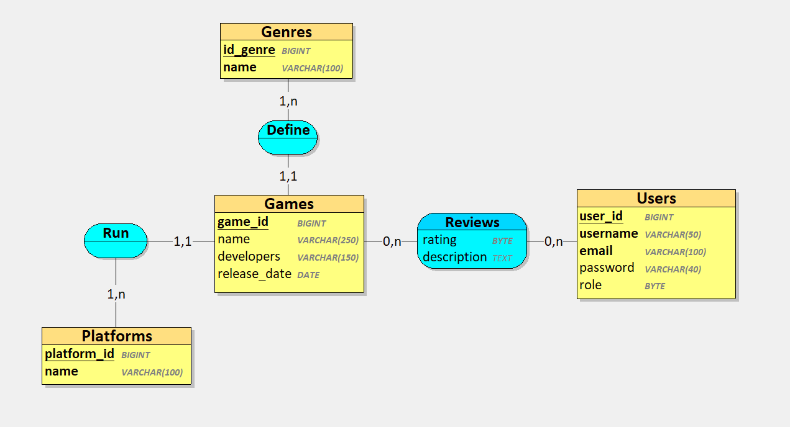

# GameReviews

## Architecture du site

### Technologies utilisées

- **Front-end** : ReactJS
- **Back-end** : NodeJS
- **API** : ExpressJS
- **BDD** : MySQL
- **Versionning** : Git / GitHub

### Structure de la base de données

### Fonctionnalités

Le projet GameReview a pour but d'être une plateforme qui héberge la plus grande partie des avis utilisateurs sur les jeux vidéos.
La plateforme recense la plus grande majorité de jeux possible et leurs informations essentielles.
Grâce à celle-ci, les utilisateurs voulant acquérir un jeu pourront avoir des avis honnêtes des joueurs sur celui-ci, plutôt que ceux des journalistes.

Les utilisateurs ont la possiblitée de consulter les avis et les notes des jeux anonymement mais pas en poster.
Pour celà ils doivent se connecter avec leurs identifiants ou dans le cas échant en créer.

Les administrateurs ont accès à des pages supplémentaires telles que la gestion des jeux, des reviews et des utilisateurs pour assurer le bon fonctionnement du site.